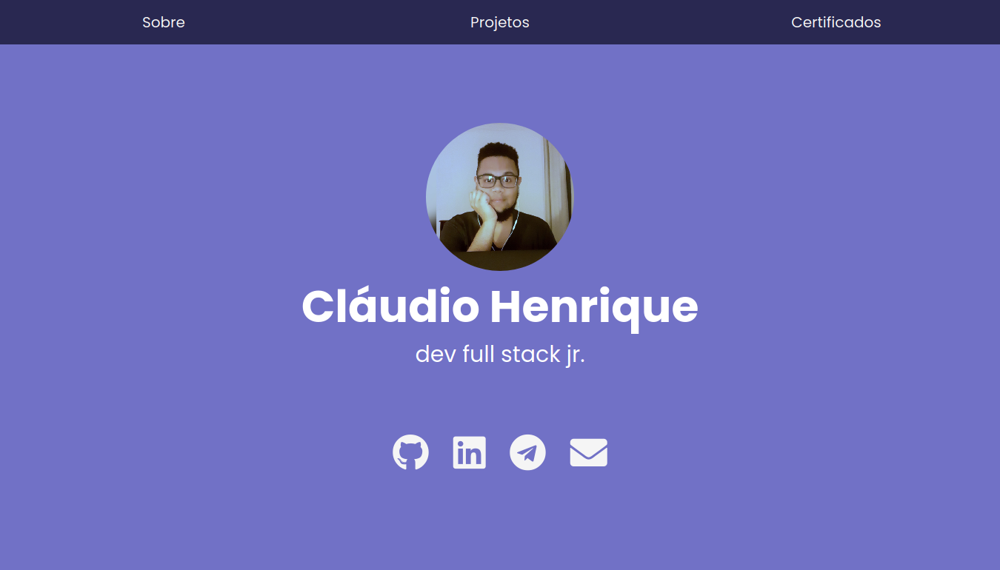

# Site Pessoal / Portfolio

## :pencil: Descrição

Olá pessoas!

Neste repositório está o meu site pessoal desenvolvido durante a Imersão CSS realizada pela [Alura](https://www.alura.com.br/).

## :computer: Tecnologias

- HTML
- CSS

## :memo: Licença

Este projeto está sob a licença do MIT. Veja o arquivo [LICENSE](LICENSE) para mais detalhes.

---

Feito com 💜 por Cláudio Henrique

